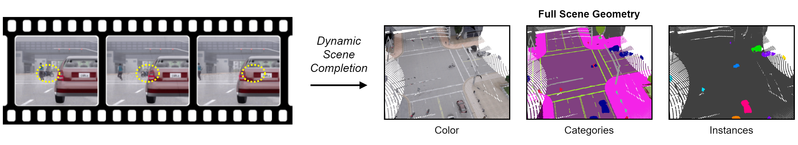

# Revealing Occlusions with 4D Neural Fields

Basile Van Hoorick, Purva Tendulkar, Dídac Surís, Dennis Park, Simon Stent, Carl Vondrick

Columbia University and Toyota Research Institute

CVPR 2022 (Oral)

[Paper](https://arxiv.org/pdf/2204.10916.pdf) | [Website](https://occlusions.cs.columbia.edu/)

<p align="center">
  
</p>

## Datasets

We contribute GREATER and CARLA, which are described and visualized on our [website](https://occlusions.cs.columbia.edu/).

[Click here](https://forms.gle/AqJ1kcwEJNJkvqpdA) to access the already generated data that we actually used to train and evaluate our models. This step is necessary to succesfully run the commands below.

[This repository](https://github.com/basilevh/carla-greater) contains the video generation code, which may be useful if you want to tweak the synthetic environments from which our datasets are sourced.

## Usage

This repository is aimed at publishing the PyTorch implementation underlying our attention-based continuous representation framework for dynamic scene completion.

We use Python 3.7.13 and libraries imported in `__init__.py`.

The commands that we used to train our models are listed below.

For GREATER:
```
CUDA_VISIBLE_DEVICES=0,1,2 python train.py --name gv1 --num_workers 52 --data_path /path/to/greater/ --batch_size 3 --up_down_blocks 3 --transition_factor 3 --pt_feat_dim 36 --pt_num_neighbors 14 --pt_norm_type none --down_neighbors 12 --n_points 14336 --n_data_rnd 14336 --video_len 12 --frame_skip 2 --pt_cube_bounds 5 --cr_cube_bounds 5 --implicit_mlp_blocks 6 --local_implicit_mode attention --cross_attn_layers 2 --cross_attn_neighbors 14 --abstract_levels 1 --color_mode rgb_nosigmoid --num_epochs 20 --density_lw 1.0 --color_lw 1.0 --segmentation_lw 0.0 --tracking_lw 1.0 --point_occupancy_radius 0.2 --air_sampling_ratio 1.5 --point_sample_bias none --past_frames 4 --future_frames 0
```

For CARLA:
```
CUDA_VISIBLE_DEVICES=0,1,2 python train.py --name cv1 --num_workers 52 --data_path /path/to/carla/ --batch_size 3 --up_down_blocks 3 --transition_factor 3 --pt_feat_dim 36 --pt_num_neighbors 16 --pt_norm_type layer --down_neighbors 12 --n_points 14336 --n_data_rnd 14336 --video_len 12 --frame_skip 3 --pt_cube_bounds 20 --cr_cube_bounds 16 --cube_mode 4 --implicit_mlp_blocks 6 --local_implicit_mode attention --cross_attn_layers 2 --cross_attn_neighbors 14 --abstract_levels 2 --semantic_classes 13 --num_epochs 40 --density_lw 1.0 --color_lw 0.0 --segmentation_lw 0.6 --tracking_lw 0.0 --point_occupancy_radius 0.2 --air_sampling_ratio 1.4 --point_sample_bias low_moving_ivalo_sembal --sample_bias occl --oversample_vehped_target 1 --past_frames 4 --future_frames 0
```

We use the wandb library for logging, but additional logs are also stored in `logs/`, while checkpointing is done in `checkpoints/`.

## Pretrained Models

Coming soon!

## BibTeX Citation

```
@inproceedings{vanhoorick2022revealing,
title={Revealing Occlusions with 4D Neural Fields},
author={Van Hoorick, Basile and Tendulkar, Purva and Sur\'is, D\'idac and Park, Dennis and Stent, Simon and Vondrick, Carl},
journal={Proceedings of the IEEE Conference on Computer Vision and Pattern Recognition (CVPR)},
year={2022}
}
```
